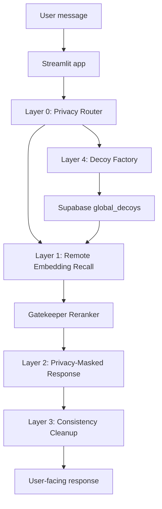

# Fortress Architecture

Fortress is a Streamlit-based research prototype for privacy-preserving peer insight retrieval in sensitive health conversations. The system is organized as a layered pipeline: classify privacy risk, retrieve semantically similar decoys, verify match quality, respond to the user, and generate additional decoys for future retrieval experiments.

## High-Level Flow

## Runtime Components

### Streamlit App

`app.py` orchestrates the user interface, session state, matching flow, response generation, and background decoy generation triggers. Streamlit secrets or environment variables provide runtime configuration.

### Layer 0: Privacy Router

Layer 0 decides whether a message should enter the privacy-preserving pipeline. The router should remain conservative: when sensitive health context is present, downstream layers should assume privacy risk is real.

### Layer 1: Remote Embedding Recall

Layer 1 calls the remote embedding API for `BAAI/bge-m3` vectors and compares user input against stored decoys with cosine similarity. This avoids loading heavyweight local embedding models on Streamlit Cloud and keeps cold starts smaller.

### Gatekeeper

The Gatekeeper reranker reviews candidate decoys after vector recall. It is intended to catch false friends: stories that share surface medical words but do not share the same core dilemma. Gatekeeper scores decide whether candidates are discarded, downgraded, or allowed to keep their similarity tier.

### Layer 2: Privacy-Masked Response

Layer 2 builds the direct assistant response using the configured chat model. The assistant identity should remain Fortress AI, and medical boundaries must stay conservative.

### Layer 3: Consistency Cleanup

Layer 3 repairs or normalizes model outputs when downstream code expects structured data. This layer is especially important for decoy generation, where malformed JSON should not crash the pipeline.

### Layer 4: Decoy Factory

Layer 4 generates anonymized decoys using a cascading fallback strategy. Gemma is tried first, Qwen is used as fallback, and rescue mode attempts to salvage the best malformed response if both providers fail. Valid decoys are saved to Supabase for future retrieval.

## Persistence

Supabase stores shared decoys in `global_decoys`. Local SQLite development files such as `confuser_conversations.db` are treated as private artifacts and must not be committed. The repository currently prioritizes public review hygiene over production-ready database migrations.

## Model Provider Boundaries

Fortress currently uses remote providers for chat, embeddings, reranking, and decoy generation. Sensitive text can leave the app runtime when those providers are called.

Current provider categories:

- Chat response model: MiniMax-compatible chat endpoint.
- Embeddings: SiliconFlow-compatible `BAAI/bge-m3` endpoint.
- Gatekeeper reranking: Qwen reranker endpoint.
- Decoy generation: Google-compatible Gemma and SiliconFlow-compatible Qwen fallback.

Before production use, provider logging, retention, training, and regional processing policies need explicit review.

## Failure Behavior

- Embedding recall can return no candidates; the app should still respond safely.
- Gatekeeper failures may fail open in some paths so the user experience does not collapse, but this is not ideal for production.
- Decoy generation can partially succeed; storing fewer than five decoys is acceptable.
- Rescue mode should prevent crashes but must be evaluated for privacy leakage.
- Email relay features are disabled for Phase 1 medical privacy compliance.

## Safety Boundaries

Fortress is not a medical device. It should not diagnose, provide treatment plans, replace emergency care, or reassure users that care is unnecessary. Privacy, consent, deletion, emergency routing, and decoy-pool abuse controls remain roadmap items before broader public use.

## Development Entry Points

- `app.py`: Streamlit application and primary orchestration.
- `fortress_models.py`: model provider configuration.
- `embedding_api.py`: remote embedding calls.
- `rerank_api.py`: Gatekeeper reranking calls.
- `layer0_router.py`: privacy routing.
- `layer1_matching.py`: similarity search and Gatekeeper filtering.
- `layer2_confuser.py`: response generation.
- `layer3_consistency.py`: output cleanup.
- `layer4_decoy_factory.py`: cascading decoy generation.
- `database_manager.py`: persistence integration.
